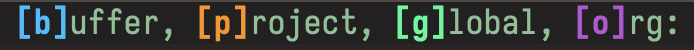
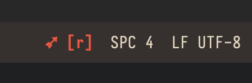

# arrow.el

<div align="center">

  <h3>Buffer-local marks</h3>
  
  <p><em>Example using my <code>init.el</code>: d → dired, o → org, l → langs, t → themes, m → magit</em></p>

  <br>

  <h3>Project marks</h3>
  
  <p><em>Example using user Emacs directory</em></p>

</div>


---

> [!NOTE]
> arrow.el is heavily inspired by the neovim plugin [arrow.nvim](https://github.com/otavioschwanck/arrow.nvim)

<p>
<br>
</p>

## About
<div align="center">
  
  <br>
</div>

Arrow introduces four layers of bookmarks to help you stay organized:
- **Global** - cross-project bookmarks
- **Project** - per-project file boookmarks
- **Buffer** - per-file line number bookmarks
- **Org** - per-project & per-buffer org bookmarks

arrow.el provides seamless navigation across all layers with a unified interface. Unlike Emacs registers or Vim/Evil marks, these are properly isolated per layer and immune to clipboard pollution (yanks/deletes won't litter your bookmarks). QOL features include visual margin markers, a floating hover menu, and at most two keybinds to jump to any bookmark.

---

## Installation

### Using `use-package` + `package-vc-install` (Emacs 29+)

```elisp
(use-package arrow
  :vc (:url "https://github.com/vmargb/arrow.el")
  :config
  (arrow-auto-mode)
  (setq arrow-org-directory "~/org/arrow-notes/"))
```

### Straight
```elisp
(use-package arrow
  :straight (arrow :type git :host github :repo "vmargb/arrow.el")
  :config
  (arrow-auto-mode)
  (setq arrow-org-directory "~/org/arrow-notes/"))
```

### Elpaca
Ensure you have `(elpaca-use-package-mode)`

```elisp
(use-package arrow
  :elpaca (arrow :host github :repo "vmargb/arrow.el")
  :config
  (arrow-auto-mode)
  (setq arrow-org-directory "~/org/arrow-notes/"))
```


### Configuration (defaults)

```elisp
(setq arrow-preview-context 0) ;; 0 lines above & below, 1 line above & below etc...
(setq arrow-auto-promote nil) ;; auto rearranges list when key added or used
(setq arrow-auto-sort nil)    ;; auto sort bookmarks by line number on add
(setq arrow-visual-marker t) ;; displays visual marker on line number
(setq arrow-visual-marker-position 'left) ;; marker position(left or right)
(setq arrow-project-modeline nil) ;; show modeline indicaor for arrow-project

;; Org layer settings
(setq arrow-org-window-behavior 'same-window) ;; 'same-window, 'other-window, 'other-frame
```

### Org integration
The Org layer extends Arrow further by dynamically linking your project to private documentation(outside of the repo). Each project has a bookmark to its own Org file, allowing every source file in the project to connect back to it. Additionally, every file in the project also has its own distinct org file.

This is not an alternative to `org-capture`: The typical org-capture flow doesn’t provide a natural forward & back-linking reading experience for reconnecting with complex codebases(especially after months away). Arrow makes documentation first-class and directly reachable from code, instead of scattering quick snippets into a global capture inbox that may never be revisited.

### `Doom-Modeline` integration (optional)

<div align="center">

<p><em>Small doom-modeline indicator showing the current project bookmark (enable with <code>setq arrow-project-modeline t</code>)</em></p>
</div>

```elisp
(with-eval-after-load 'doom-modeline
  (doom-modeline-def-segment arrow-project
    (arrow-project-modeline-string))
  (doom-modeline-add-segment 'arrow-project 'misc-info :after 'main))
```

### `project.el` integration (optional)
Add your project level bookmarks to `project.el`'s minibuffer commands
to quickly jump to a project and file without typing:

```elisp
(with-eval-after-load 'project
  (add-to-list 'project-switch-commands
               '(arrow-project-show "Bookmarks") t)
  (define-key project-prefix-map "." #'arrow-project-show))
```


## Commands

### Buffer bookmarks (line numbers)

| Command                  | Description                               |
| ------------------------ | ----------------------------------------- |
| `arrow-add`              | Create bookmark at point (keys: a-z, 1-9) |
| `arrow-show`             | Popup menu of buffer bookmarks            |
| `arrow-delete`           | Remove specific bookmark                  |
| `arrow-clear-all`        | Delete all buffer bookmarks               |
| `arrow-promote-bookmark` | Move bookmark to top of list              |
| `arrow-next-line` / `arrow-prev-line` | Cycle bookmarks                       |
| `arrow-reorder`          | Interactively reorder buffer bookmarks    |
| `arrow-sort-bookmarks`   | Sort buffer bookmarks by line number (one-shot) |

### Project bookmarks (files)
| Command                                     | Description                           |
| ------------------------------------------- | ------------------------------------- |
| `arrow-project-add`                         | Add current file to project bookmarks |
| `arrow-project-show`                        | Show project bookmark menu            |
| `arrow-project-delete`                      | Remove project bookmark               |
| `arrow-project-next` / `arrow-project-prev` | Cycle bookmarks                       |
| `arrow-project-reorder`                     | Interactively reorder project bookmarks |

### Org bookmarks
| Command                        | Description                              |
| ------------------------------ | ---------------------------------------- |
| `arrow-org-open-project`       | Toggle project notes ↔ source file       |
| `arrow-org-open-file`          | Toggle file-specific notes ↔ source file |
| `arrow-org-list-project-notes` | Browse all project notes                 |

**Smart return**: `arrow-org-open-project` and `open-file` remembers exactly which file you came from even across different files in the same project and restores your cursor position.


## Unified workflow (simpler)
If the above commands are too overwhelming `arrow-jump` has you covered.

| Command      | Description                     |
| ------------ | ------------------------------- |
| `arrow-jump` | Unified command for every layer |


#### Example keybinds
```elisp
;; Buffer
(define-key arrow-mode-map (kbd "C-c b a") #'arrow-add) ;; add line number mark
(define-key arrow-mode-map (kbd "C-c b l") #'arrow-show) ;; show lines numbers
(define-key arrow-mode-map (kbd "C-c b d") #'arrow-delete) ;; delete line number
(define-key arrow-mode-map (kbd "C-c b j") #'arrow-jump-buffer) ;; jump to line (no UI)
(define-key arrow-mode-map (kbd "C-c b n") #'arrow-next-line) ;; next line
(define-key arrow-mode-map (kbd "C-c b p") #'arrow-prev-line) ;; previous line
(define-key arrow-mode-map (kbd "C-c b r") #'arrow-reorder) ;; reorder bookmarks

;; Project
(define-key arrow-mode-map (kbd "C-c p a") #'arrow-project-add) ;; add project file mark
(define-key arrow-mode-map (kbd "C-c p l") #'arrow-project-show) ;; show all files
(define-key arrow-mode-map (kbd "C-c p d") #'arrow-project-delete) ;; delete file
(define-key arrow-mode-map (kbd "C-c p j") #'arrow-jump-project) ;; jump to file (no UI)
(define-key arrow-mode-map (kbd "C-c p n") #'arrow-project-next) ;; next file
(define-key arrow-mode-map (kbd "C-c p p") #'arrow-project-prev) ;; previous file
(define-key arrow-mode-map (kbd "C-c p r") #'arrow-project-reorder) ;; reorder bookmarks

;; Org
(define-key arrow-mode-map (kbd "C-c o o") #'arrow-org-open-project)  ; project notes
(define-key arrow-mode-map (kbd "C-c o f") #'arrow-org-open-file)     ; file notes  
(define-key arrow-mode-map (kbd "C-c o l") #'arrow-org-list-project-notes)
```

**General keybinds:**
These are my keybindings, feel free to copy them.
```elisp
;; Buffer
","  '(:ignore t :which-key "marks")
",," '(arrow-show :which-key "show")
",a" '(arrow-add            :which-key "add")
",j" '(arrow-jump-buffer    :which-key "add")
",d" '(arrow-delete         :which-key "delete")
",c" '(arrow-clear-all      :which-key "clear all")
",n" '(arrow-next-line      :which-key "next")
",p" '(arrow-prev-line      :which-key "prev")
",r" '(arrow-reorder        :which-key "reorder")
;; Project layer
"."  '(:ignore t :which-key "project marks")
".." '(arrow-project-show   :which-key "show")
".j" '(arrow-jump-project   :which-key "show")
".a" '(arrow-project-add    :which-key "add")
".d" '(arrow-project-delete :which-key "delete")
".n" '(arrow-project-next   :which-key "next")
".p" '(arrow-project-prev   :which-key "prev")
".r" '(arrow-project-reorder :which-key "reorder")
;; Global layer
"/" '(:ignore t :which-key "global")
"//" '(arrow-global-show    :which-key "sow")
"/a" '(arrow-global-add     :which-key "add")
"/j" '(arrow-jump-global    :which-key "add")
"/d" '(arrow-global-delete  :which-key "delete")
"/c" '(arrow-global-clear-all :which-key "clear all")
"/n" '(arrow-global-next    :which-key "next")
"/p" '(arrow-global-prev    :which-key "prev")
"/r" '(arrow-global-reorder :which-key "reorder")
;; arrow-Org
"oo" '(arrow-org-list-project-notes :which-key "org list notes")
"of" '(arrow-org-open-file          :which-key "org for file")
"oF" '(arrow-org-open-function      :which-key "org function for file")
"op" '(arrow-org-open-project       :which-key "org for project")
;; Unified
";" '(arrow-jump :which-key "arrow global")
```

## Todo

- Unified hydra-like menu that shows buffer-local, project & global bookmarks together