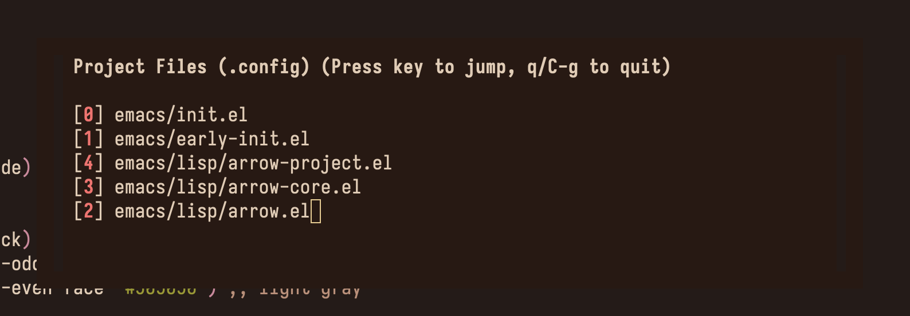

# arrow.el

arrow.el is heavily inspired by the neovim plugin [arrow.nvim](https://github.com/otavioschwanck/arrow.nvim)

<div align="center">

  <h3>Bookmarks Example</h3>
  
  <p><em>Example using my <code>init.el</code>: d → dired, o → org, l → langs, t → themes, m → magit</em></p>

  <br>

  <h3>Project Example</h3>
  
  <p><em>Example using user Emacs directory</em></p>

</div>


---

## About
Arrow introduces three layers of bookmarks to help you stay organized:
- **Global** - cross-project bookmarks
- **Project** - per-project file boookmarks
- **Buffer** - per-file line number bookmarks

arrow.el provides seamless navigation across all three layers with a unified interface. Unlike Emacs registers or Vim/Evil marks, these are properly isolated per layer and immune to clipboard pollution (yanks/deletes won't litter your bookmarks). QOL features include visual fringe markers, a floating hover menu, and at most two keybinds to jump to any bookmark.

### Org integration
The Org layer extends Arrow further by dynamically linking your code to living documentation. Each project automatically gets its own Org file, allowing every source file to connect back to it. Additionally, every file in a project has its own unique org note.

---

## Installation

### Using `use-package` + `package-vc-install` (Emacs 29+)

```elisp
(use-package arrow
  :vc (:fetcher "github" :repo "vmargb/arrow.el")
  :config
  (require 'arrow-org) ; optional org bookmarks
  (setq arrow-org-directory "~/org/arrow-notes/"))
```

### Straight
```elisp
(use-package arrow
  :straight (arrow :type git :host github :repo "vmargb/arrow.el")
  :config
  (require 'arrow-org) ; optional org bookmarks
  (setq arrow-org-directory "~/org/arrow-notes/"))
```

### Elpaca
Ensure you have `(elpaca-use-package-mode)`

```elisp
(use-package arrow
  :elpaca (arrow :host github :repo "vmargb/arrow.el")
  :config
  (require 'arrow-org) ; optional org bookmarks
  (setq arrow-org-directory "~/org/arrow-notes/"))
```


### Configuration (defaults)

```elisp
(setq arrow-persist t) ;; persists bookmark on disk
(setq arrow-auto-promote nil) ;; auto rearranges list when key added or used
(setq arrow-visual-marker t) ;; displays visual marker on line number
(setq arrow-visual-marker-position 'left) ;; marker position(left or right)

;; Org layer settings
(setq arrow-org-window-behavior 'same-window) ;; 'same-window, 'other-window, 'other-frame
```

## Commands

### Buffer bookmarks (line numbers)

| Command                  | Description                               |
| ------------------------ | ----------------------------------------- |
| `arrow-add`              | Create bookmark at point (keys: a-z, 1-9) |
| `arrow-show`             | Popup menu of buffer bookmarks            |
| `arrow-delete`           | Remove specific bookmark                  |
| `arrow-clear-all`        | Delete all buffer bookmarks               |
| `arrow-promote-bookmark` | Move bookmark to top of list              |
| `arrow-next-line` / `arrow-prev-line` | Cycle bookmarks                       |

### Project bookmarks (files)
| Command                                     | Description                           |
| ------------------------------------------- | ------------------------------------- |
| `arrow-project-add`                         | Add current file to project bookmarks |
| `arrow-project-show`                        | Show project bookmark menu            |
| `arrow-project-delete`                      | Remove project bookmark               |
| `arrow-project-next` / `arrow-project-prev` | Cycle bookmarks                       |

### Unified workflow (No UI)
Use these when you've confidently memorized your marks.

| Command | Description |
|-------------|---------|
| `arrow-jump-buffer` | Instantly jump to buffer line without popup menu. |
| `arrow-jump-project` | Instantly jump to project file without popup menu. |
| `arrow-jump` | Unified command for the above two options. |

### Org bookmarks
| Command                        | Description                              |
| ------------------------------ | ---------------------------------------- |
| `arrow-org-open-project`       | Toggle project notes ↔ source file       |
| `arrow-org-open-file`          | Toggle file-specific notes ↔ source file |
| `arrow-org-list-project-notes` | Browse all project notes                 |

**Smart return**: `arrow-org-open-project` and `open-file` remembers exactly which file you came from even across different files in the same project and restores your cursor position.


#### Example keybinds
```elisp
;; Buffer
(define-key arrow-mode-map (kbd "C-c b a") #'arrow-add) ;; add line number mark
(define-key arrow-mode-map (kbd "C-c b l") #'arrow-show) ;; show lines numbers
(define-key arrow-mode-map (kbd "C-c b d") #'arrow-delete) ;; delete line number
(define-key arrow-mode-map (kbd "C-c b j") #'arrow-jump-buffer) ;; jump to line (no UI)
(define-key arrow-mode-map (kbd "C-c b n") #'arrow-next-line) ;; next line
(define-key arrow-mode-map (kbd "C-c b p") #'arrow-prev-line) ;; previous line

;; Project
(define-key arrow-mode-map (kbd "C-c p a") #'arrow-project-add) ;; add project file mark
(define-key arrow-mode-map (kbd "C-c p l") #'arrow-project-show) ;; show all files
(define-key arrow-mode-map (kbd "C-c p d") #'arrow-project-delete) ;; delete file
(define-key arrow-mode-map (kbd "C-c p j") #'arrow-jump-project) ;; jump to file (no UI)
(define-key arrow-mode-map (kbd "C-c p n") #'arrow-project-next) ;; next file
(define-key arrow-mode-map (kbd "C-c p p") #'arrow-project-prev) ;; previous file

;; Org
(define-key arrow-mode-map (kbd "C-c o o") #'arrow-org-open-project)  ; project notes
(define-key arrow-mode-map (kbd "C-c o f") #'arrow-org-open-file)     ; file notes  
(define-key arrow-mode-map (kbd "C-c o l") #'arrow-org-list-project-notes)
```

**General keybinds:**
```elisp
"m"  '(:ignore t :which-key "marks")

;; Buffer layer
"mb" '(:ignore t :which-key "buffer")
"mba" '(arrow-add          :which-key "add")
"mbs" '(arrow-show         :which-key "show")
"mbd" '(arrow-delete       :which-key "delete")
"mbc" '(arrow-clear-all    :which-key "clear all")
"mbn" '(arrow-next-line    :which-key "next")
"mbp" '(arrow-prev-line    :which-key "prev")
"mbj" '(arrow-jump-buffer  :which-key "jump")

;; Project layer
"mp" '(:ignore t :which-key "project")
"mpa" '(arrow-project-add    :which-key "add")
"mps" '(arrow-project-show   :which-key "show")
"mpd" '(arrow-project-delete :which-key "delete")
"mpn" '(arrow-project-next   :which-key "next")
"mpp" '(arrow-project-prev   :which-key "prev")
"mpj" '(arrow-jump-project   :which-key "jump")

;; Global layer
"mg" '(:ignore t :which-key "global")
"mga" '(arrow-global-add    :which-key "add")
"mgs" '(arrow-global-show   :which-key "show")
"mgd" '(arrow-global-delete :which-key "delete")
"mgc" '(arrow-global-clear-all :which-key "clear all")
"mgn" '(arrow-global-next   :which-key "next")
"mgp" '(arrow-global-prev   :which-key "prev")
"mgj" '(arrow-jump-global   :which-key "jump")

;; Unified
"mj" '(arrow-jump :which-key "jump (auto)")

;; Org (unchanged, already has a good home)
"of" '(arrow-org-open-file          :which-key "org for this file")
"op" '(arrow-org-open-project       :which-key "org for this project")
"ol" '(arrow-org-list-project-notes :which-key "org list notes")
```

## Screenshot

*Example using my init.el: d->dired, o->org, l->langs, t->themes, m->magit*


*Example using user emacs directory*


## Todo

- arrow-jump repeat style feature to allow fast cycling without repetition
- Unified hydra-like menu that shows buffer-local + project bookmarks together
- Org bookmark integration with org-capture templates