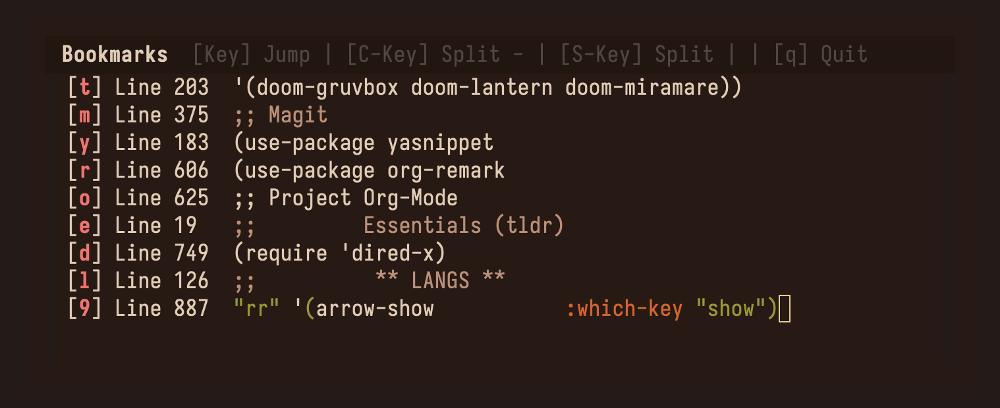

# arrow.el

arrow.el is heavily inspired by the neovim plugin [arrow.nvim](https://github.com/otavioschwanck/arrow.nvim)

## What problem this solves
Every editor should have three layers of bookmarks, global(built-in), project-scoped(harpoon-style), and buffer-scoped -> arrow.el.
This lets you set marks inside of a buffer and jump to them with a single keypress. Vim/Evil registers and Emacs registers can do this but they are not isolated per buffer. And this gives you more QOL features such as:
- **File-scoped marks:** Unlike Emacs registers (or vim/evil registers), marks created with arrow.el are isolated to each file.
- **Quick navigation:** Jump to a mark in one keypress with transient menu showing each mark and its line contents.
- **Visual selector:** Compact UI which shows each mark in a visual window as well as fringe marks in the buffer.

---

## Installation

Add to your load path and require:

```elisp
(add-to-list 'load-path "/path/to/arrow")
(require 'arrow)

(add-hook 'prog-mode-hook #'arrow-mode)
(add-hook 'text-mode-hook #'arrow-mode)
```

Or use `use-package`:

```elisp
(use-package arrow
  :load-path "/path/to/arrow")
```

### Configuration (defaults)

```elisp
(setq arrow-persist t) ;; persists bookmark in memory
(setq arrow-auto-promote t) ;; auto promotes key when added or used
```


## Commands

| Key Binding | Command | Description |
|-------------|---------|-------------|
| `C-c b a` | `arrow-add` | Create or overwrite a bookmark at point. Prompts for a single character (a-z or 0-9). |
| `C-c b l` | `arrow-show` | Display popup of all bookmarks for this file. Press any bookmark key to jump, `q` or `C-g` to cancel. |
| `C-c b d` | `arrow-delete` | Remove a specific bookmark by its character key. |
| `C-c b C` | `arrow-clear-all` | Delete all bookmarks for the current file and remove its storage file. |
| `C-c b p` | `arrow-promote-bookmark` | Manually promote a bookmark to the top of the list. |

## Screenshot

*Example using my init.el: d->dired, o->org, g->general, t->themes, m->magit*


## Todo

- fringe marker on line
- Project-scoped transient menu
